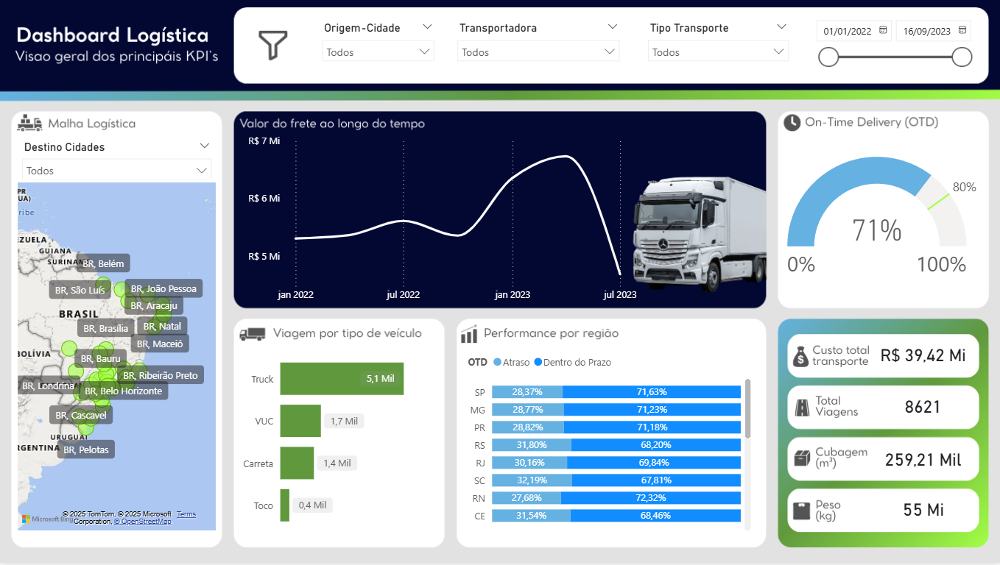

# 🚚 Dashboard de Logística em Power BI

Este projeto apresenta um dashboard interativo desenvolvido no Power BI para análise de indicadores logísticos, com foco em transporte, entregas e desempenho regional.

## 🎯 Objetivo

Visualizar os principais KPIs logísticos de forma clara e estratégica, apoiando decisões com base em dados reais: custos, prazos, tipos de transporte, volume e performance por região.

## 🌟 Funcionalidades

- Segmentação por cidade de origem, transportadora, tipo de transporte e período
- Mapa de rotas com destinos logísticos
- Gráfico de linha com evolução do valor do frete ao longo do tempo
- Gráfico de velocímetro para KPI de On-Time Delivery (OTD)
- Gráfico de barras por tipo de veículo
- Gráfico de barras empilhadas com performance por região
- Indicadores de custo total, total de viagens, cubagem e peso
- Narrativas automáticas com IA para insights rápidos

## 🛠 Tecnologias

- Power BI Desktop
- DAX (Data Analysis Expressions)
- Modelagem de dados
- Visualizações interativas
- Canva (criação da tela de fundo personalizada para o dashboard)

## 📷 Preview

## 📁 Arquivo
O arquivo `.pbix` está disponível na pasta `Arquivo/`.

## 📬 Contato
Caso queira saber mais ou colaborar, entre em contato pelo [LinkedIn](http://www.linkedin.com/in/ana-beatriz-marques-ferreira-42125121a).

